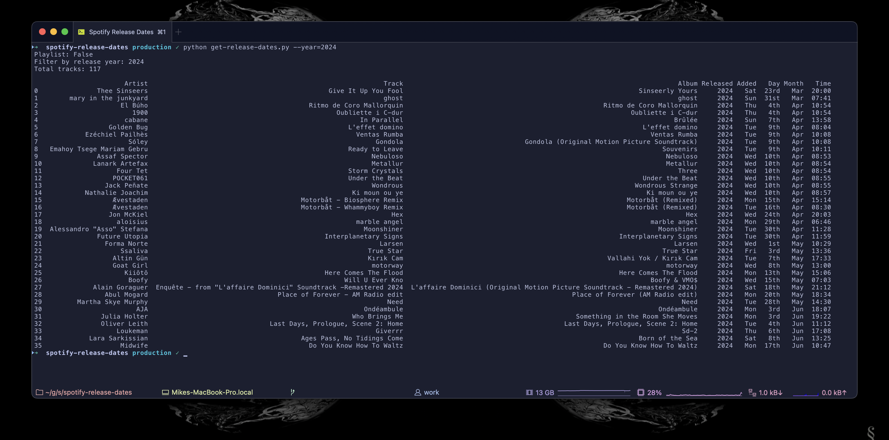
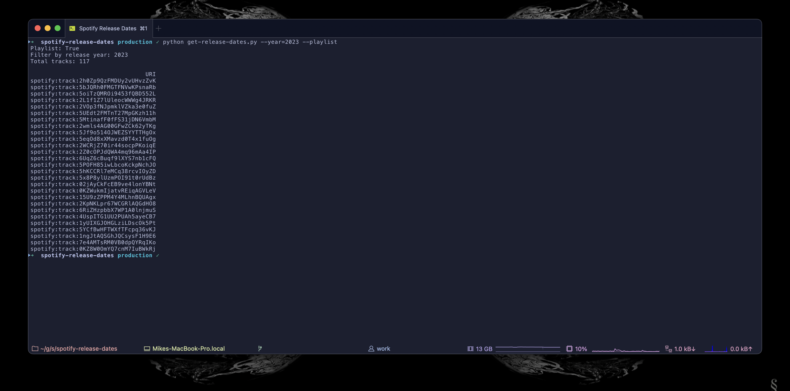

# Spotify Release Dates
Quick and dirty way to loop over multiple playlists and extract release dates + optionally filter by specific year + sort tracks by date added

## Usage
1. git clone ``
1. Create a Spotify Developer account and create a new app to get your client ID and client secret - [quick youtube guide here](https://www.youtube.com/watch?v=kaBVN8uP358)
1. Set your Spotify client ID, secret and playlist ID's in the `./get-release-dates.py` script
1. Install the required packages `pip install -r requirements.txt`
1. Run the script:
  - `python get-release-dates.py` to display all tracks in the playlists with their release date
  - `python get-release-dates.py --playlist` to generate a playlist you can copy & paste into Spotify

### Preview

## Credits
Nabbed and mutated from this super helpful [Stack Overflow post](https://stackoverflow.com/a/77714867)
